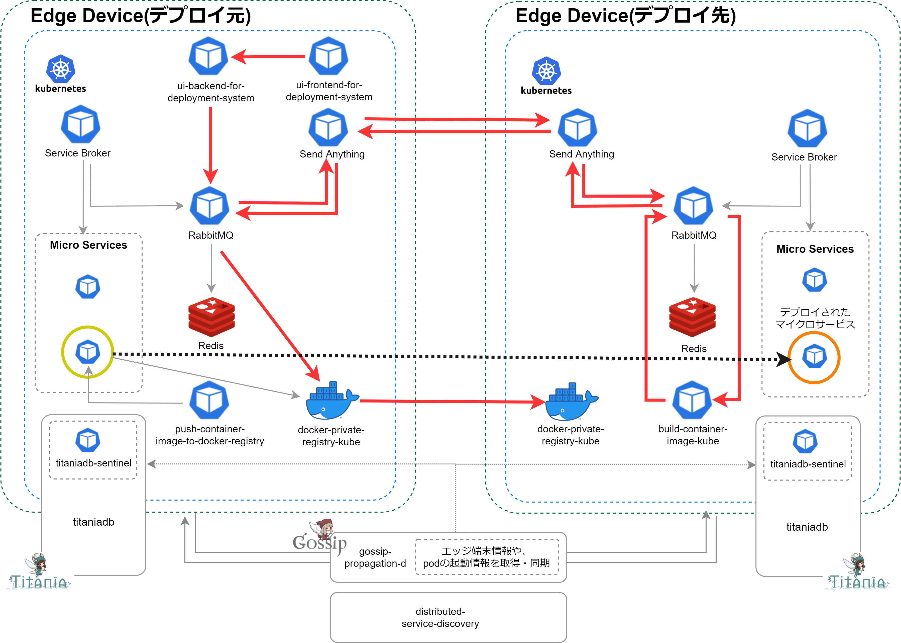
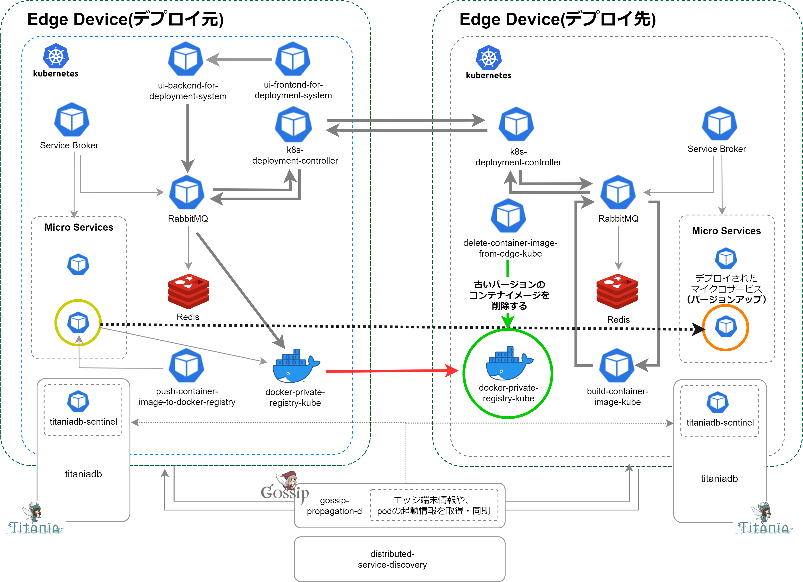

# container-deployment-system
container-deployment-system は、クラウドから遮断されたクローズドなエッジネットワーク環境において、複数のエッジ端末間であらゆるコンテナリソースの共有・相互デプロイを可能にするデプロイメントシステムです。  
container-deployment-system がセットアップされた端末群においては、任意の端末がコンテナのデプロイ元にもデプロイ先にもなります。  

## container-deployment-system のアーキテクチャ  
### コンテナデプロイ   
以下の図はコンテナデプロイメントシステムのアーキテクチャ図です。  
図内の赤い矢印は、コンテナデプロイのリクエストが行われてから、実際にエッジ端末間でコンテナがデプロイされるまでの順序を示しています。

図内の赤い矢印の詳細順序は以下の通りです。   
①ui-frontend-for-deployment-system（デプロイ元）   
②ui-backend-for-deployment-system（デプロイ元）  
（RabbitMQ）  
③k8s-deployment-controller（デプロイ元）    
④k8s-deployment-controller（デプロイ先）  
（RabbitMQ）  
⑤build-container-image-kube（デプロイ先）     
（RabbitMQ）  
⑥k8s-deployment-controller（デプロイ先）  
⑦k8s-deployment-controller（デプロイ元）    
（RabbitMQ）  
⑧docker-private-registry-kube（デプロイ元）    
⑨docker-private-registry-kube（デプロイ先）  

### コンテナデプロイ（バージョンアップ時）
一度デプロイしたマイクロサービスのバージョンを上げてデプロイした場合は、 エッジ端末間でコンテナデプロイが行われた後、delete-container-image-from-edge-kubeにより、古いバージョンのコンテナイメージが削除されます。  
コンテナイメージの削除は、以下の図において緑色の矢印で示されている箇所です。 

## container-deployment-system に含まれるリソース

container-deployment-system には、以下の マイクロサービス等 のリソースが含まれます。  

・[aion-core](https://github.com/latonaio/aion-core)および関連リソース  
・[ui-frontend-for-deployment-system](https://github.com/latonaio/ui-frontend-for-deployment-system)     
・[ui-backend-for-deployment-system](https://github.com/latonaio/ui-backend-for-deployment-system)  
・[k8s-deployment-controller](https://github.com/latonaio/k8s-deployment-controller)  
・[build-container-image-kube](https://github.com/latonaio/build-container-image-kube)      
・[push-container-image-to-docker-registry](https://github.com/latonaio/push-container-image-to-docker-registry)    
・[docker-private-registry-kube](https://github.com/latonaio/push-container-image-to-docker-registry)    
・[titaniadb](https://github.com/latonaio/titaniadb)    
・[titaniadb-sentinel](https://github.com/latonaio/titaniadb-sentinel)    
・[gossip-propagation-d](https://github.com/latonaio/gossip-propagation-d)    
・[distributed-service-discovery](https://github.com/latonaio/distributed-service-discovery)  
・[delete-container-image-from-edge-kube](https://github.com/latonaio/delete-container-image-from-edge-kube)
## 動作環境

* OS: Linux  
* CPU: ARM/AMD/Intel  
* Memory: 8GB 以上推奨  
* Storage: 64GB 以上推奨 (OS領域とは別に主にコンテナイメージ実装・稼働のために必要です。通常のエッジ端末で64GBを確保するには、外付けMicroSDやSSDが必要です）  
* aion-core および 関連リソース  

## services.yml  
container-deployment-system は、aion-service-definitions/services.yml の設定をすることで、動作させることができます。  
サンプルのservices.ymlファイルが、本レポジトリに含まれています。  

## titaniadb, gossip-propagation-d, distrributed-service-discovery の起動・稼働
titaniadb, gossip-propagation-d, distrributed-service-discovery は、上記の services.yml には含まれていません。  
titaniadbは、kube対応されていないため、手動で起動し、稼働させる必要があります。  
gossip-propropagation-d, distrributed-service-discovery は、Runtime 環境がOSレイヤーです。これらはsystemd等でOS層で自動起動・稼働させるか、手動で起動・稼働させる必要があります。