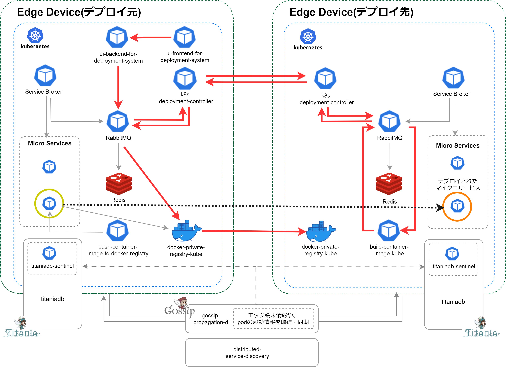

# container-deployment-system
container-deployment-system は、クラウドから遮断されたクローズドなエッジネットワーク環境において、複数のエッジ端末間であらゆるコンテナリソースの共有・相互デプロイを可能にするデプロイメントシステムです。  
container-deployment-system がセットアップされた端末群においては、任意の端末がコンテナのデプロイ元にもデプロイ先にもなります。  

## container-deployment-system のアーキテクチャ  
コンテナデプロイメントシステムのアーキテクチャ図です。  
図内の赤い矢印は、コンテナデプロイのリクエストが行われてから、実際にエッジ端末間でコンテナがデプロイされるまでの順序を示しています。

図内の赤い矢印の詳細順序は以下の通りです。   
①ui-frontend-for-deployment-system（デプロイ元）   
②ui-backend-for-deployment-system（デプロイ元）  
（RabbitMQ）  
③Send Anything（デプロイ元）  
④Send Anything（デプロイ先）  
（RabbitMQ）  
⑤build-container-image-kube（デプロイ先）     
（RabbitMQ）  
⑥Send Anything（デプロイ先）  
⑦Send Anything（デプロイ元）    
（RabbitMQ）  
⑧docker-private-registry-kube（デプロイ元）    
⑨docker-private-registry-kube（デプロイ先）  

## container-deployment-system に含まれるリソース

container-deployment-system には、以下の マイクロサービス等 のリソースが含まれます。  

・[aion-core](https://github.com/latonaio/aion-core)および関連リソース  
・[ui-frontend-for-deployment-system](https://github.com/latonaio/ui-frontend-for-deployment-system)     
・[ui-backend-for-deployment-system](https://github.com/latonaio/ui-backend-for-deployment-system)      
・[build-container-image-kube](https://github.com/latonaio/build-container-image-kube)    
・[push-container-image-to-docker-registry](https://github.com/latonaio/push-container-image-to-docker-registry)    
・[docker-private-registry-kube](https://github.com/latonaio/push-container-image-to-docker-registry)    
・[titaniadb](https://github.com/latonaio/titaniadb)    
・[titaniadb-sentinel](https://github.com/latonaio/titaniadb-sentinel)    
・[gossip-propagation-d](https://github.com/latonaio/gossip-propagation-d)    
・[distributed-service-discovery](https://github.com/latonaio/distributed-service-discovery)  

## 動作環境

* OS: Linux  
* CPU: ARM/AMD/Intel  
* Memory: 8GB 以上推奨  
* Storage: 64GB 以上推奨 (OS領域とは別に主にコンテナイメージ実装・稼働のために必要です。通常のエッジ端末で64GBを確保するには、外付けMicroSDやSSDが必要です）  